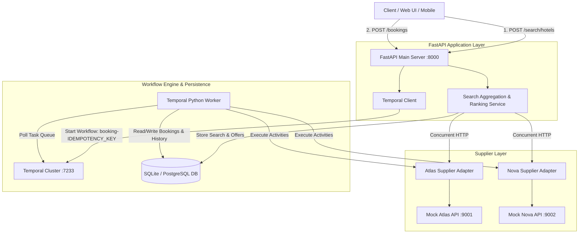
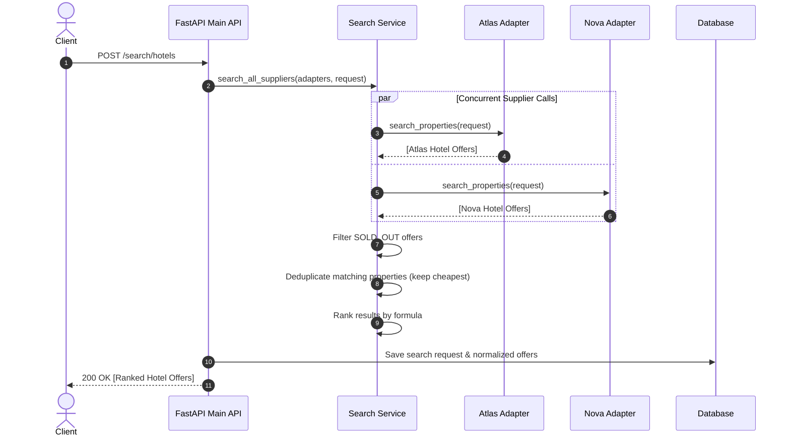
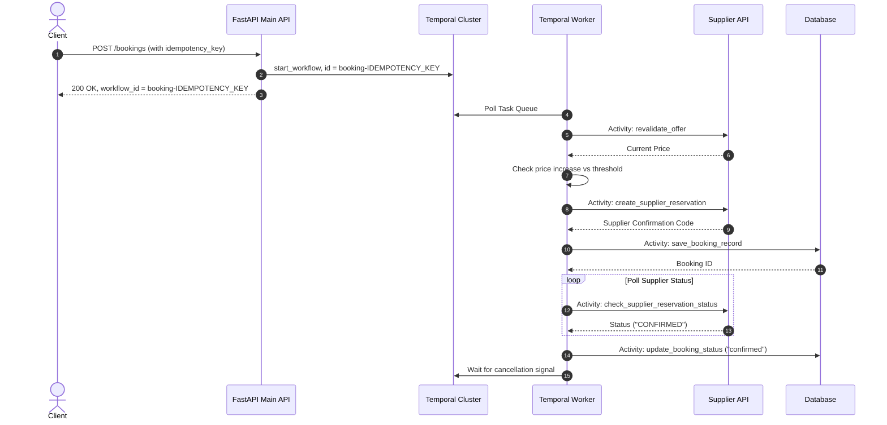

# System Architecture & Flow

This document details the architecture of the Travel Supplier Aggregator service, including component roles, request flows, search aggregation strategy, and the Temporal workflow design for reliable booking management.

---

## 1. System Overview Diagram



---

## 2. Component Breakdown

### A. FastAPI Service (`app/api/main.py`)
- Provides standardized REST endpoints for search and booking execution.
- Generates and injects a unique `X-Request-ID` via middleware for tracing requests end-to-end.
- Enforces duplicate booking prevention at the entry point by deriving Temporal workflow IDs from the client's `idempotency_key`.

### B. Supplier Integration Layer (`app/suppliers/`)
- **`SupplierAdapter` (Abstract Base Class)**: Defines contract for `search_properties`, `get_price_and_availability`, `create_reservation`, `get_reservation_status`, `normalize_reservation_status`, and `cancel_reservation`.
- **`AtlasAdapter` & `NovaAdapter`**: Translate supplier-specific payloads into/from the shared `HotelOffer` schema. Handle supplier-specific pricing rules (e.g. Atlas percentage tax vs Nova flat fees) and availability status mappings.

### C. Search Aggregation & Ranking (`app/services/search_service.py`)
- **Concurrent Execution**: Searches all configured supplier adapters concurrently via `asyncio.gather` with a per-supplier timeout (5 seconds).
- **Fault Tolerance**: Supplier errors or timeouts are caught gracefully without failing the request (returns partial results).
- **Filtering**: Automatically excludes `SOLD_OUT` inventory.
- **Deduplication**: Identifies duplicate listings across suppliers based on normalized property name, location, and room type, retaining the cheapest offer.
- **Ranking Engine**: Ranks offers based on normalized price, availability type, and supplier confidence weighting:
  ```
  score = supplier_confidence - (total_price / max_price_in_result_set) - availability_penalty
  ```
  Higher score ranks first. See `app/services/search_service.py::_rank` for the exact implementation.

### D. Booking Lifecycle & Temporal Workflows (`app/workflows/`)
- **`BookingWorkflow`**: State machine driving the booking lifecycle:
  1. Offer price revalidation.
  2. Threshold check (`max_price_increase_pct`).
  3. Supplier reservation creation.
  4. Internal database record persistence.
  5. Asynchronous polling for supplier confirmation.
  6. Final state recording (`confirmed`, `failed`, `cancelled`, or `manual_review`).
  7. Long-polling state for post-confirmation cancellation requests via Temporal signals.
- **Compensation & Recovery**: If supplier reservation succeeds but internal DB persistence fails, compensation triggers automatically to cancel the supplier reservation and flag the booking for `manual_review`.

---

## 3. Data Flow Diagrams

### Search Flow



### Booking Flow


