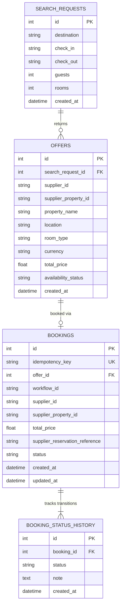

# Database Schema & Persistence Model

The application uses SQLAlchemy ORM backed by SQLite - a local file for
plain local development, or a file inside a Docker named volume when run
via Compose (shared between the main API and worker containers). Swapping
to PostgreSQL for app data would only require changing `DATABASE_URL`; no
model or query code is Postgres-incompatible. PostgreSQL is also present
in the stack, but backs Temporal's own internal storage, not this app's
tables.

---

## Entity Relationship Diagram

---

## Table Descriptions

### 1. `search_requests`
Stores historical metadata for incoming user search queries.
- `id` (INTEGER, Primary Key): Unique search request identifier.
- `destination` (VARCHAR, Not Null): Target destination city.
- `check_in` / `check_out` (VARCHAR, Not Null): ISO date strings.
- `guests` / `rooms` (INTEGER, Not Null): Quantity specifications.
- `created_at` (DATETIME): Timestamp of request.

### 2. `offers`
Stores normalized offers returned and presented to users during searches.
- `id` (INTEGER, Primary Key): Unique offer identifier.
- `search_request_id` (INTEGER, FK -> `search_requests.id`): Parent search query.
- `supplier_id` (VARCHAR): `atlas` or `nova`.
- `supplier_property_id` (VARCHAR): Supplier's property identifier.
- `property_name`, `location`, `room_type`, `currency` (VARCHAR).
- `total_price` (FLOAT): Calculated total price including taxes and fees.
- `availability_status` (VARCHAR): `available` or `on_request`.

### 3. `bookings`
Internal record of booking requests and their current workflow states.
- `id` (INTEGER, Primary Key): Internal booking ID.
- `idempotency_key` (VARCHAR, Unique, Not Null): Client-provided key for idempotency enforcement.
- `offer_id` (INTEGER, FK -> `offers.id`, Nullable): Optional reference to original search offer.
- `workflow_id` (VARCHAR, Not Null): Temporal workflow ID (`booking-{idempotency_key}`).
- `supplier_id` / `supplier_property_id` (VARCHAR).
- `total_price` (FLOAT): Agreed booking total price.
- `supplier_reservation_reference` (VARCHAR, Nullable): Supplier confirmation code.
- `status` (VARCHAR, Not Null): Current status (`pending`, `reserved`, `confirmed`, `cancelling`, `cancelled`, `failed`, `manual_review`).

### 4. `booking_status_history`
Audit log recording every status transition and associated diagnostic notes/failure reasons.
- `id` (INTEGER, Primary Key).
- `booking_id` (INTEGER, FK -> `bookings.id`).
- `status` (VARCHAR): Target state of transition.
- `note` (TEXT, Nullable): Details, error messages, or failure reasons.
- `created_at` (DATETIME).
